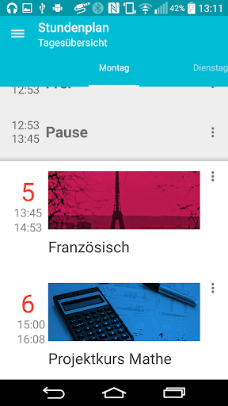

# Timetable Now - Stundenplan Now
An app for the easy and fast organisation of your Timetable.

## Summary

This app will provide you with your timetable all day.
It doesn't matter if on your smartphone or your smartwatch. Before the lesson will start, you will get a notification on your wrist and on your phone. A widget on your homescreen gives you the relevant information for the day.

## Screenshots

<table style="border:none;">
  <tr>
    <td>
      
    </td>
    <td>
      
    </td>
    <td>
      
    </td>
    <td>
      
    </td>
  </tr>
  <tr>
    <td colspan="2">
      
    </td>
    <td colspan="2">
      
    </td>
  </tr>
</table>

## Features:
* Support for smartphones, smartwatches und tablets
* Design adapted to the new Material Design of Google
* View your lesson per day or for the complete week
* You can have multiple timetables at once

**Notice:**
<strike>This app is still under development and not yet fully ready. Ideas for features or reports about bugs are always welcomed!</strike>

Smartwatches must be running on Android Wear.